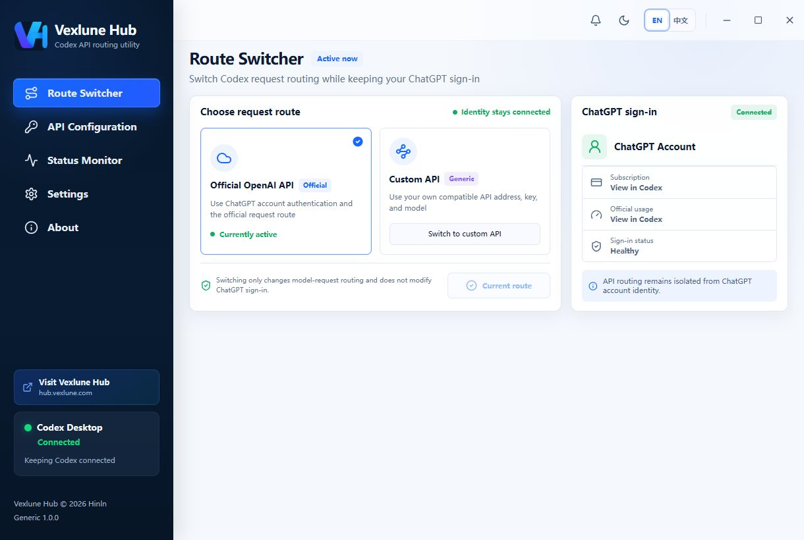
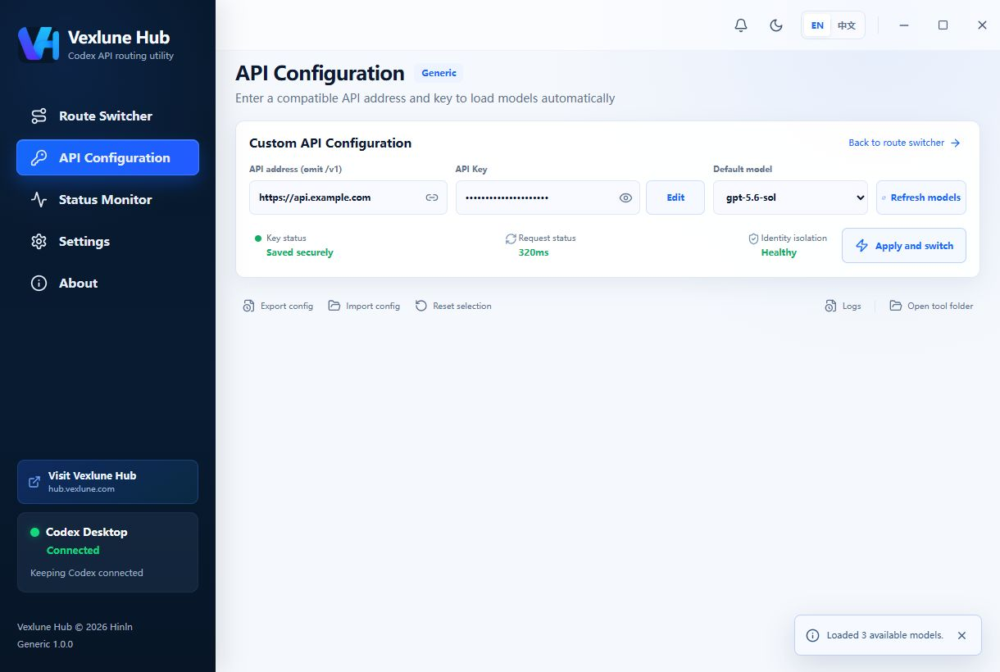
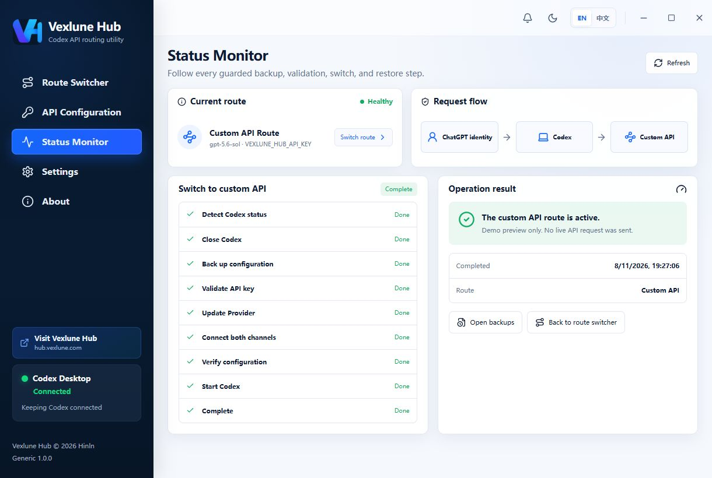

<p align="center">
  
</p>

<h1 align="center">CodexGo</h1>

<p align="center">
  由 Vexlune Hub 开发的 Windows Codex Desktop 开源 API 路由切换工具。<br>
  自行填写 OpenAI 兼容 API 地址与密钥，自动获取模型，同时保留 ChatGPT 登录态和现有会话。
</p>

<p align="center">
  <a href="README.md">English</a> · <a href="README.zh-CN.md">简体中文</a>
</p>

<p align="center">
  <a href="https://github.com/Hinln/codexgo/releases/latest/download/CodexGo-v1.0.0-windows-x64.exe"><strong>下载 Windows x64 版</strong></a>
  · <a href="https://github.com/Hinln/codexgo/releases/latest">版本说明</a>
  · <a href="https://github.com/Hinln/codexgo/releases/latest/download/CodexGo-v1.0.0-windows-x64-SHA256.txt">SHA-256</a>
</p>

> 当前版本：1.0.0 · Windows 10/11 x64 · MIT License<br>
> GitHub：[Hinln/codexgo](https://github.com/Hinln/codexgo)


## 它解决什么问题

Codex Desktop 的账号身份和模型请求线路并不是同一件事。很多用户既希望保留
ChatGPT 登录、订阅信息和已有任务，又需要把模型请求临时切换到自建网关、本地服务
或其他 OpenAI 兼容 API。

手工修改 `config.toml`、环境变量和会话 Provider 元数据容易出现以下问题：

- API 地址被拼成 `/v1/v1`，导致 Models 或 Responses 请求失败；
- 切换线路后丢失原 Provider，不知道如何安全恢复；
- API Key 被写入配置、脚本或日志；
- 配置已修改，但会话或环境变量只完成了一半；
- 把 ChatGPT 登录凭据和第三方 API Key 混为一谈；
- 直接编辑大型会话文件，意外改变消息正文或任务内容。

CodexGo 将这些步骤组织成一个可验证、可恢复的桌面事务，并用图形界面显示每一步
的状态。

## 与常见 API 切换工具的区别

下面比较的是常见实现方式，不针对某个具体项目。

| 维度 | 常见做法 | CodexGo |
|---|---|---|
| 请求转发 | 启动常驻本地代理，所有流量先经过工具 | 不建立代理，直接写入 Codex Provider 配置 |
| ChatGPT 登录态 | 第三方 Key 与账号登录容易混在一起 | 强制 `requires_openai_auth = true`，身份通道与模型请求凭据分离 |
| API 地址 | 用户自行处理 `/v1`，容易重复拼接 | 输入、后端和最终配置三层规范化，保证末尾只有一个 `/v1` |
| 模型选择 | 手工输入模型名称 | 地址和密钥填写完成后自动调用 Models API 获取模型，也保留手动刷新 |
| 配置修改 | 字符串替换或覆盖整个配置文件 | 使用 TOML 结构化编辑，保留无关配置和注释，并执行原子写入 |
| 失败处理 | 出错后要求用户手工恢复 | 切换前备份配置、会话和环境状态，提交失败自动回滚 |
| 会话连续性 | 不处理会话，或整文件粗暴替换 | 只迁移已确认的 `model_provider` 元数据，不改变消息、任务 ID、工作目录或工具调用 |
| API Key | 写入配置文件或应用数据 | 只保存到当前 Windows 用户环境变量 `VEXLUNE_HUB_API_KEY` |
| 故障信息 | 统一显示“连接失败” | 区分 401、403、429、5xx、DNS、TLS、代理、超时和连接错误 |
| 恢复线路 | 固定恢复成 OpenAI，可能覆盖用户原配置 | 恢复首次切换前的真实 Provider、模型和推理强度 |

## 支持项目

如果 CodexGo 对你的工作流程有所帮助，
欢迎在 GitHub 上点一个 ⭐ 支持项目。

你的 Star 可以帮助更多开发者发现 CodexGo。

## 核心优势

### 1. 登录身份与模型路由真正分离

工具不会读取、复制、删除或修改 `auth.json` 内容，只检查它是否存在。自定义 Provider
继续使用：

```toml
requires_openai_auth = true
```

因此切换的是模型请求线路，而不是 ChatGPT 账号身份。Codex 中的登录态、账号入口和已有
会话可以继续保留。

### 2. 永远只生成一个 `/v1`

界面保存的是不带末尾 `/v1` 的 API 根地址，实际请求和 Codex 配置再补一个 `/v1`。

| 用户输入 | 界面保存 | 实际 API Base URL |
|---|---|---|
| `https://api.example.com` | `https://api.example.com` | `https://api.example.com/v1` |
| `https://api.example.com/v1` | `https://api.example.com` | `https://api.example.com/v1` |
| `https://api.example.com/v1/v1/` | `https://api.example.com` | `https://api.example.com/v1` |
| `https://example.com/openai/v1` | `https://example.com/openai` | `https://example.com/openai/v1` |

远程地址必须使用 HTTPS。本机 `localhost`、`127.0.0.1` 和其他回环地址可以使用 HTTP，
方便连接本地 OpenAI 兼容服务。

### 3. 自动发现模型

当 API 地址和 Key 停止输入约 0.7 秒后，工具自动请求：

```text
{API_ROOT}/v1/models
```

返回的模型会直接进入下拉列表。手动“刷新可用模型”按钮仍然保留，便于服务临时失败后
重试。切换时还会再次验证所选模型，避免保存已经失效的模型 ID。

### 4. 事务式切换和恢复

完整流程包含：

```text
检测 Codex → 关闭 Codex → 创建备份 → 验证 API
→ 原子更新 Provider → 迁移会话元数据 → 保存环境变量
→ 校验结果 → 重新启动 Codex
```

任一提交步骤失败，工具会尝试恢复操作前的配置、会话和环境变量状态。恢复官方线路时，
使用首次切换前保存的基线，不会凭空猜测用户原来的 Provider。

### 5. 不接管网络环境

本工具不会：

- 建立本地代理或常驻转发服务；
- 修改 `hosts`、DNS、系统代理或系统证书；
- 下载并执行远程程序；
- 把真实 API Key、Authorization、提示词或会话正文写入日志。

## 界面截图

| 线路切换 | API 配置 |
|---|---|
|  |  |

### 切换事务已完成



截图使用本地演示桥接和虚构 API 凭据生成，未发送真实 API 请求，也未使用任何真实凭据。

## 使用方法

1. 从[最新版本](https://github.com/Hinln/codexgo/releases/latest)下载并启动 `CodexGo-v1.0.0-windows-x64.exe`。
2. 打开“API 配置”。
3. 填写 API 根地址，例如 `https://api.example.com`。
4. 填写 API Key，等待模型自动加载。
5. 选择默认模型，点击“应用并切换线路”。
6. 工具完成备份、验证、切换后自动重新启动 Codex Desktop。

需要回到原线路时，在首页选择 OpenAI 官方线路并执行恢复。自定义 API Key 默认保留，
方便下次切换；回到官方线路后可在设置中心单独删除保存的 Key。

> 当前 Windows 可执行文件未进行 Authenticode 代码签名，Microsoft Defender SmartScreen
> 可能显示“未知发布者”。运行前请核对 Release 中公布的 SHA-256。

## Codex Provider 配置示例

假设用户填写 `https://api.example.com/v1`，最终写入的核心配置类似：

```toml
model_provider = "vexlune_hub"
model = "your-selected-model"
model_reasoning_effort = "xhigh"

[model_providers.vexlune_hub]
name = "Vexlune Hub Custom API"
base_url = "https://api.example.com/v1"
env_key = "VEXLUNE_HUB_API_KEY"
wire_api = "responses"
requires_openai_auth = true
```

Key 不会写入 `config.toml`，而是保存到当前 Windows 用户的环境变量：

```text
HKCU\Environment\VEXLUNE_HUB_API_KEY
```

## 兼容性说明

目标服务至少需要兼容以下接口之一：

- `GET /v1/models`；
- OpenAI Responses API 风格的 `POST /v1/responses`。

不同中转服务对模型名称、参数、工具调用和流式响应的兼容程度可能不同。本项目不能保证
所有声称“OpenAI 兼容”的服务都与 Codex 完整兼容。请优先使用可信服务，并阅读其隐私、
计费与数据保留政策。

## 数据与安全边界

- `auth.json`：只检查存在性，不读取内容，也不进入备份。
- API Key：使用 `Zeroizing` 缩短敏感字符串在内存中的生命周期，只保存到当前用户环境变量。
- 配置：通过 `toml_edit` 结构化修改并原子提交。
- 会话：JSONL 流式处理，SQLite 使用事务和备份 API。
- 网络：阻止跨协议、跨域名或跨端口重定向。
- 日志：只记录脱敏的诊断信息，不记录 Key 和会话正文。
- 备份：默认位于 `%CODEX_HOME%\switcher-backups\`。
- 日志：默认位于 `%LOCALAPPDATA%\CodexGo\logs\`。

当自定义线路启用时，模型请求及相关上下文会发送到用户填写的 API 服务。选择和信任该
服务是用户自己的决定。

## 从源码构建

### 环境要求

- Windows 10/11 x64；
- Node.js 与 pnpm；
- Rust stable；
- Visual Studio 2022 C++ Build Tools 与 Windows SDK；
- Microsoft Edge WebView2 Runtime。

### 开发与测试

```powershell
pnpm install --frozen-lockfile
pnpm build:web
pnpm test:sites
cargo fmt --manifest-path src-tauri\Cargo.toml -- --check
cargo test --manifest-path src-tauri\Cargo.toml
```

### 生成便携 EXE

```powershell
pnpm tauri build --no-bundle
```

输出文件：

```text
src-tauri\target\release\CodexGo.exe
```

正式发布文件遵循 `CodexGo-v{version}-windows-x64.exe` 命名规则。

也可以运行：

```powershell
powershell -ExecutionPolicy Bypass -File scripts\build-release.ps1
```

## 技术栈

- React 19 + TypeScript；
- Tauri 2；
- Rust；
- `reqwest` + rustls；
- `toml_edit`；
- `rusqlite`；
- Windows Registry / Win32 API。

## 项目结构

```text
src/                  React 桌面界面
src-tauri/src/api/    地址规范化、Models/Responses 验证
src-tauri/src/codex/  配置、会话和 Codex 路径处理
src-tauri/src/storage/事务备份、恢复状态和脱敏审计
src-tauri/src/windows/环境变量、进程与 Windows Shell
scripts/              构建与发布脚本
tests/                Sites 静态构建测试
```

## Vexlune Hub

软件保留 Vexlune Hub 品牌署名。界面中的“访问 Vexlune Hub”按钮只会使用系统默认浏览器
打开 [https://hub.vexlune.com](https://hub.vexlune.com)，不会把该网站设为 API 地址，也不
会改变当前请求线路。

## 贡献

欢迎提交 Issue 和 Pull Request。涉及 Provider 配置、会话迁移、环境变量或备份恢复的改动，
请同时补充测试，并确保测试数据不包含真实 API Key、Token、提示词或用户会话内容。

## License

本项目采用 [MIT License](LICENSE) 开源。

## 免责声明

本项目是独立工具，与 OpenAI 不存在官方隶属或认可关系。“OpenAI”“ChatGPT”“Codex”
等名称归其各自权利人所有。使用第三方 API 产生的费用、服务可用性和数据处理责任由用户
与对应服务提供方承担。

开发者：Hinln
